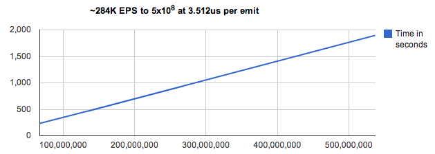

.. prggmr documentation master file, created by
   sphinx-quickstart on Wed Dec 19 20:57:45 2012.

XPSPL - PHP Signal Processing Library
=====================================

XPSPL is a high performance signal processor for the PHP programming language.

Table of Contents
-----------------

.. toctree::
   :maxdepth: 2
   :glob:

   install
   configuration
   .. quickstart

API
---

All API functions are non-namespaced, globally available.

.. toctree::
   :maxdepth: 1
   :glob:

   api/*

Modules
-------

XPSPL Bundled modules.

.. toctree::
   :maxdepth: 1

   modules/ftp

Source
------

XPSPL is hosted on Github_.

.. _Github: https://github.com/prggmr/XPSPL

Performance
-----------

These tests were generated using v4.0.0 on a 2.7GHZ i5 processor.

The above benchmark demonstrates scaling to an upperbound of 500 million emitted signals, 
the vertical axis represents the amount of time in seconds 
with the horizontal axis representing the amount of signals emitted.

The benchmark demonstrates almost linear scale of ~3.5us per emit equating to ~284,000 signals per second.

Author
------

XPSPL has been designed and developed by Nickolas C. Whiting.

Support
-------

Support for XPSPL is offered through two support channels.

.. Core
.. ----

.. XPSPL Internal Documentation

.. The core classes and functions of XPSPL.

.. .. toctree::
..    :maxdepth: 1
..    :glob:

..    xpspl/*
..    xpspl/*/*

Mailing list
____________

A mailing list provided by Google Groups_.

.. _Groups: https://groups.google.com/forum/?fromgroups#!forum/prggmr

IRC
___

An IRC channel by irc.freenode.net ``#prggmr``.

Search
------

* :ref:`search`

